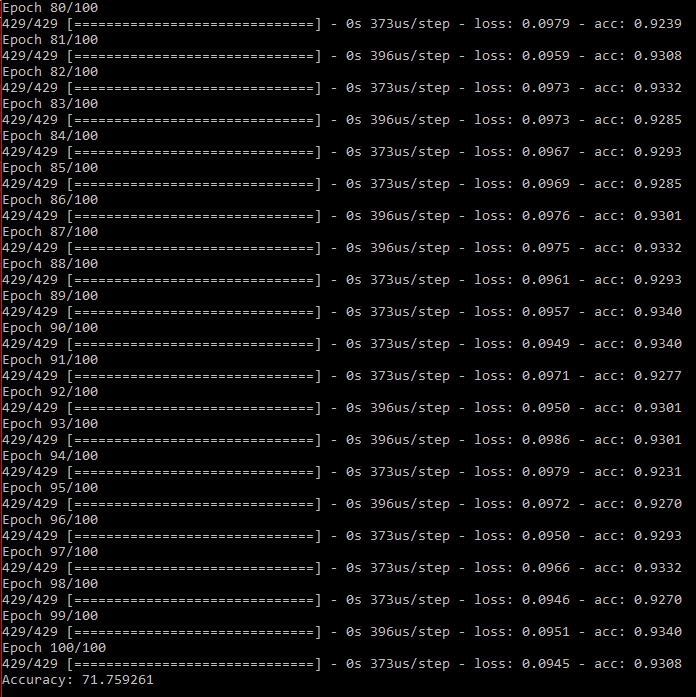

# Poem Categorisation using Neural Networks

The purpose of this project is to categorize poems into different types.

### Dataset Used

The dataset used for training was compiled by *PoetryFoundation.org* which is available on *Kaggle* and is also included in the 
repo. The dataset contains the 574 poems along with their poets and their genre (type). We only require the poems 
and their type for our training needs.

### Packages Required

The code was built on a `Python 3.6` environment with the following external libraries:

* `keras`
* `pandas`
* `numpy`
* `scikit-learn`
* `nltk`
* `textblob`

### What's in the Repo

1. `poems.csv` - Dataset used for training the model (also available on *Kaggle*)
1. `poems.py` - Main trainer program that pre-processes the data, builds and trains the model

### Solution

#### Pre-Processing Data

I had never worked with text data for categorisation so I had to research a bit in order to train a model that could categorize 
poems in the form of text. Cleaning of the dataset comes first. First of all, not all the words in the poem necessarily 
contribute in determining the category of the poem. Words like *a, you, my, is,* etc. have least impact so they were removed with 
the help of *stopwords* python module. The most frequent and least frequent words were also removed. Suffixes such as *ing, ly, s,*
etc. were removed for maintaining consistency across all poems. At this point all the basic pre-processing has been done.

Now in order to work with text in neural networks we need to convert them to certain numbers or hashes so that they can be fed 
into the neural networks and trained. For this task the function for one hot coding in the *keras pre-processing library* was 
used. The function creates hashes for each word in the dataset vocabulary. 

#### Building the Model

I have built a fairly simple model that uses three layers namely *Embedding Layer, Flatten Layer, and Dense Layer* for training. 
*Embedding* is a layer that’s frequently used while dealing with text classification. *Flatten* is used to reduce the dimensionality 
of Embedding layer’s output since the *Dense* layer takes in one dimensional data as input.

### Output Snippet

* A snippet showing last few Epochs and the *Accuracy*

### Conclusion

The model gives an accuracy that varies from ***71.55%*** to ***72.3%*** which I think is fair enough for a model this simple and for a dataset this limited. But is this accuracy good enough? Probably not, but the model can definitely be improved using various other layers. 

There are three categories of poems in the dataset. So, even if a person randomly guesses the categories his probability of 
being accurate will be *33.33%* and the model gives an accuracy of ***72%*** so we can say that model is performing a  
significantly good categorization.
